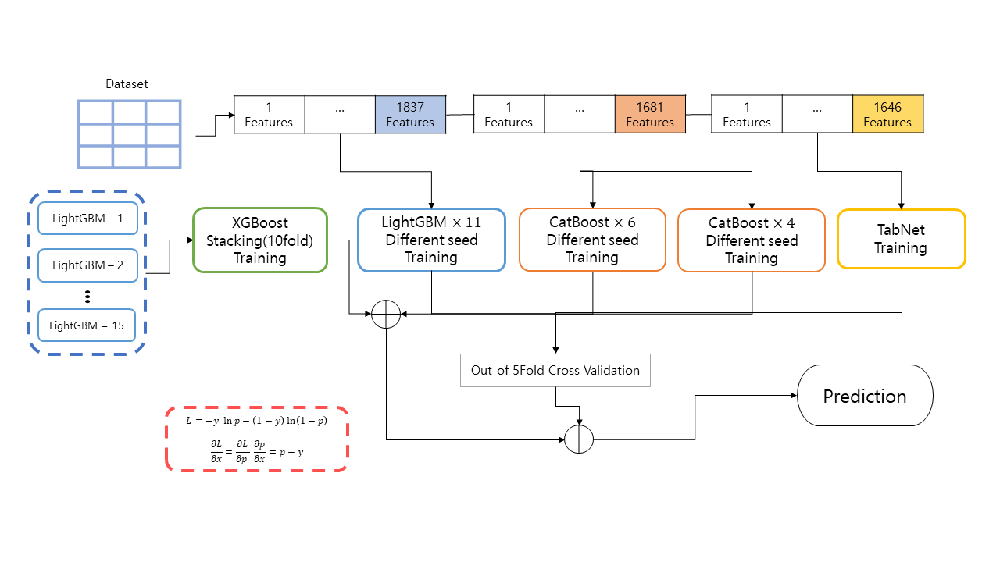

# amex-default-prediction
### Introduction
This repository is the code that placed ?th [American Express - Default Prediction](https://www.kaggle.com/competitions/amex-default-prediction/overview)

### Model Architecture


### Benchmark
|Model|CV|Public LB|Private LB|
|-----|--|------|---------|
|XGBoost(10-KFold - gbdt)|0.792|0.793|-|
|TabNet(10-StratifiedKFold)|0.789|0.790|-|
|CatBoost(5-StratifiedKFold sdist-lag-features - dart) - seed22|0.7953|0.797|-|
|CatBoost(5-StratifiedKFold sdist-lag-features - dart) - seed42|0.7954|0.797|-|
|CatBoost(5-StratifiedKFold sdist-lag-features - dart) - seed99|0.7958|0.797|-|
|CatBoost(5-StratifiedKFold sdist-lag-features - dart) - seed3407|0.7948|0.797|-|
|LightGBM(5-StratifiedKFold time-features - shap - dart) - trick|0.7970|0.797|-|
|LightGBM(5-StratifiedKFold time-lag-features - dart) - trick|0.7973|0.797|-|
|LightGBM(5-StratifiedKFold diff-features - dart) - trick|0.7973|0.799|-|
|LightGBM(5-StratifiedKFold trick-features - dart) - seed42|0.7977|0.798|-|
|LightGBM(5-StratifiedKFold sdist-features - dart) - seed22|**0.7981**|0.798|-|
|LightGBM(5-StratifiedKFold sdist-features - dart) - seed42|0.7979|0.798|-|
|LightGBM(5-StratifiedKFold sdist-features - dart) - seed88|0.7977|**0.799**|-|
|LightGBM(5-StratifiedKFold sdist-features - dart) - seed94|0.7972|**0.799**|-|
|LightGBM(5-StratifiedKFold sdist-features - dart) - seed99|0.7979|**0.799**|-|
|LightGBM(5-StratifiedKFold sdist-features - dart) - seed2020|0.7978|0.798|-|
|LightGBM(5-StratifiedKFold sdist-features - dart) - seed2222|0.7976|**0.799**|-|
|LightGBM(5-StratifiedKFold sdist-features - dart) - seed3407|0.7977|**0.799**|-|
|LightGBM(5-StratifiedKFold sdist-lag-features - dart) - seed3407|0.7977|**0.799**|-|
|LightGBM(5-StratifiedKFold bruteforce-features - dart) - seed42|**0.7981**|**0.799**|-|
|LightGBM(5-StratifiedKFold bruteforce-features - dart) - seed99|0.7979|**0.799**|-|
|LightGBM(5-StratifiedKFold bruteforce-features - dart) - seed3407|0.7978|**0.799**|-|
|LightGBM(5-StratifiedKFold sdist-lag-features - dart) - seed5230|0.7963|**0.799**|-|
|XGBoost(10-KFold - stacking regression)|0.7985|0.799|-|
|Ensemble is Always Answer|**0.79952**|**0.799**|-|

### Project Organization
```
├── LICENSE
├── README.md
├── config                 <- config yaml files
│
├── res
|   ├── data               <- encoding pickle file
|   └── models             <- Trained and serialized models
|
├── notebooks              <- ipykernel
│
└── src                    <- Source code for use in this project
    │
    ├── data               <- Scripts to preprocess data
    │   └── dataset.py
    │
    ├── features           <- Scripts of feature engineering
    |   ├── build.py
    |   └── select.py
    |
    ├── models             <- build train models
    |   ├── base.py
    |   ├── boosting.py
    |   ├── callbacks.py   
    |   ├── infer.py
    |   ├── network.py
    |   └── stacking.py
    |
    ├── tuning             <- tuning models by optuna
    |   ├── base.py
    |   └── boosting.py
    │
    └── utils              <- utils files
        └── utils.py
```

### Setting
```
conda env create -f environment.yaml  # might be optional
conda activate amex
```

### Reference
+ [DART: Dropouts meet Multiple Additive Regression Trees](https://arxiv.org/abs/1505.01866)
+ [rounding-trick](https://www.kaggle.com/code/jiweiliu/amex-catboost-rounding-trick)
+ [time-features](https://www.kaggle.com/code/cdeotte/time-series-eda)
+ [pay-features](https://www.kaggle.com/code/jiweiliu/rapids-cudf-feature-engineering-xgb)
+ [Ensemble model](https://www.sciencedirect.com/science/article/pii/S0957417421003407)
+ [feature-engineering](https://www.kaggle.com/code/susnato/amex-data-preprocesing-feature-engineering)
+ [statement-features](https://www.kaggle.com/code/romaupgini/statement-dates-to-use-or-not-to-use)
+ [seed-number](https://paperswithcode.com/paper/torch-manual-seed-3407-is-all-you-need-on-the)
+ [clean-data](https://www.kaggle.com/competitions/amex-default-prediction/discussion/328514)
--------
Project based on the [cookiecutter data science project template](https://drivendata.github.io/cookiecutter-data-science/) & [microsoft recommenders](https://github.com/microsoft/recommenders/tree/main/recommenders).

